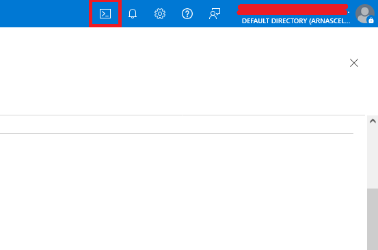
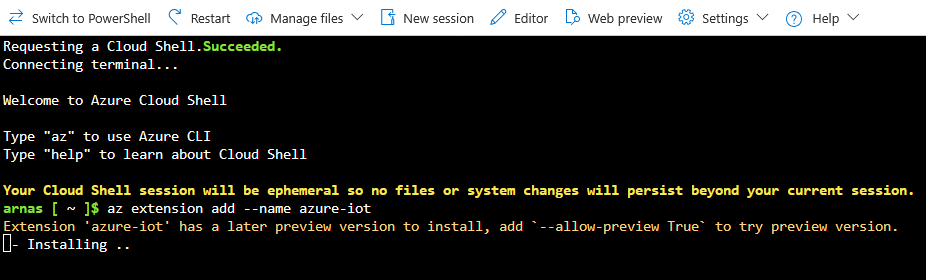
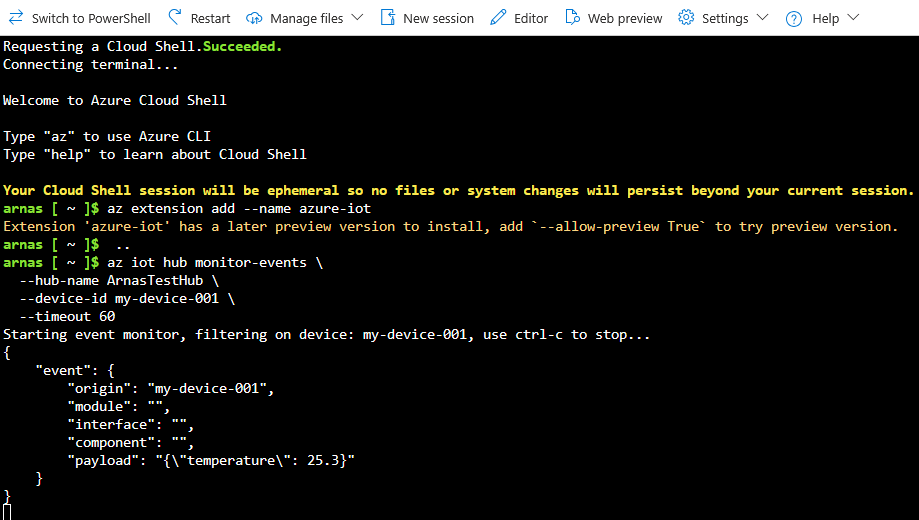
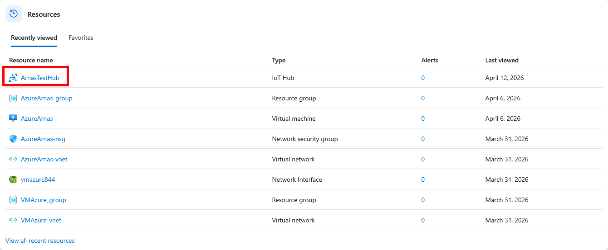
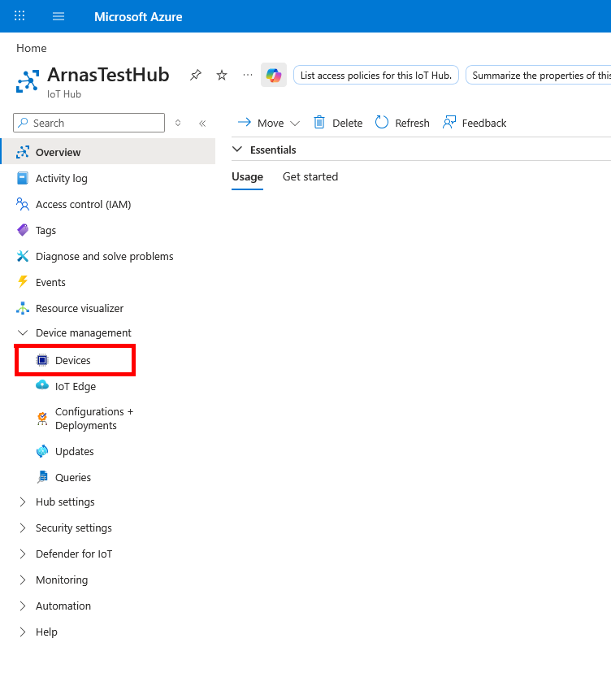
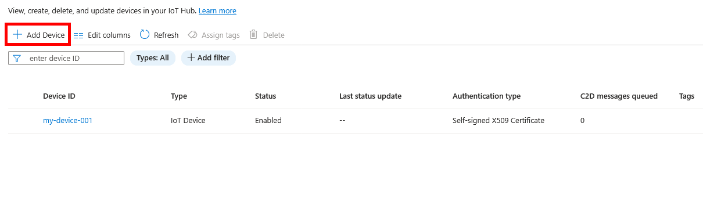
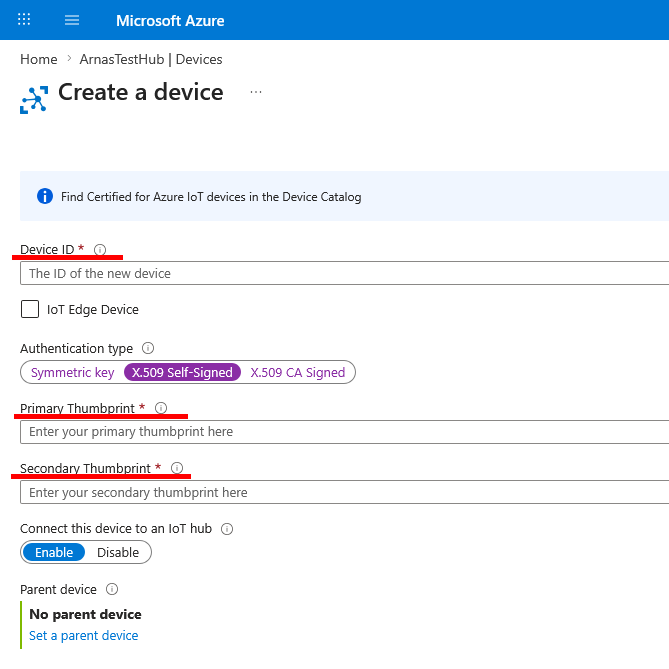

# Renesas RZ + optiga-tpm2 use with Microsoft Azure Iot hub

## The security chain:

```bash
TPM Chip (hardware)
    └── Private key at 0x81000001 < ONLY exists here
            └── Signs TLS handshake
                    └── Azure verifies signature matches registered cert
                            └── Connection allowed
```

The private key cannot be extracted, exported, or stolen even with full root access to the device. It is stored at a persistent handle "0x81000001"
If at any point the tpm board will be disconnected connections to Azure automatically wont work.

---

SETUP:

Yocto build requires meta-tpm2 layer with recipes:
```
tpm2-tss-engine tpm2-tss tpm2-totp tpm2-tools tpm2-pytss tpm2-pkcs11 tpm2-openssl tpm2-abrmd packagegroup-tpm2-initramfs packagegroup-tpm2
```

openembedded-core layer:
```
openssl
```

As well as meta-networking for mqtt:
```
mosquitto
```

## Step 1: Create TPM2 Primary Key
```bash
tpm2_createprimary -C o -c primary.ctx
```

## Step 2: Create TPM2 Child Key
```bash
tpm2_create -C primary.ctx -G rsa -u key.pub -r key.priv
```

## Step 3: Load and Persist the Key

### Load key into TPM
```bash
tpm2_load -C primary.ctx -u key.pub -r key.priv -c key.ctx
```
### Verify
```bash
tpm2_getcap handles-persistent
```
### Should show: 0x81000001 if not make it persistent
```bash
tpm2_evictcontrol -C o -c key.ctx 0x81000001
```

## Step 4: Generate Certificate
make sure to change the device name from "my-device-001" to a prefered name, it will later be used in azure portal too.
-subj "/CN=my-device-001" \ < Change the device name
```bash
OPENSSL_MODULES=/usr/lib/ossl-modules openssl req -x509 \
  -provider tpm2 -provider default \
  -key "handle:0x81000001" \
  -subj "/CN=my-device-001" \
  -days 365 \
  -out /root/device.crt
```

## Step 5: Get Certificate Thumbprint
```bash
openssl x509 -in /root/device.crt -noout -fingerprint -sha1 \
  | sed 's/.*=//' | tr -d ':'
```
### Example output: 133E693916CD55ECB3F19F2D10E8C0FE600B92A4


Step 6: Download Azure CA Certificate
```bash
wget https://cacerts.digicert.com/DigiCertGlobalRootG2.crt.pem -P ~/
```

## Step 7: Register Device in Azure Portal

1. Go to IoT Hub > Device management > Devices > Add device
2. Device ID: Your device id / example > my-device-001
3. Authentication type: X.509 Self-Signed
4. Primary thumbprint and Secondary thumbprint: paste from Step 5
5. Click Save

## Step 8: Download MQTT message sending application
```bash
https://github.com/JewelDesu/rz_tpm2/blob/main/send_mqtt.sh
```

## Step 9: Run the application

```bash
chmod +x /root/send_mqtt.sh
```
```bash
./send_mqtt.sh
```

Pressing Enter on prompt with default value uses the value shown in brackets
```bash
Device ID: my-device-001 # Name of the device
Hub hostname [ArnasTestHub.azure-devices.net]: # Hub hostname
Certificate path [/root/device.crt]: # Cert path
Number of messages to send [1]: 5 # Number of messages to send
Message payload [{'temperature': 25.0}]: {"id": {i}, "temp": 22.5} # Payload message
```

---

### To verify if azure is getting the messages

Open azure shell



Install IOT extension
```bash
az extension add --name azure-iot
```



Enable event monitor for a certain device
```bash
az iot hub monitor-events \
  --hub-name ArnasTestHub \
  --device-id my-device-001 \
  --timeout 60
```


---
# Adding devices to Azure IOT
## Go to IoT Hub

## Device management > Devices

## Add device

### Device ID: Your device id / example > my-device-001
### Authentication type: X.509 Self-Signed
### Primary thumbprint and Secondary thumbprint: paste from Step 5

